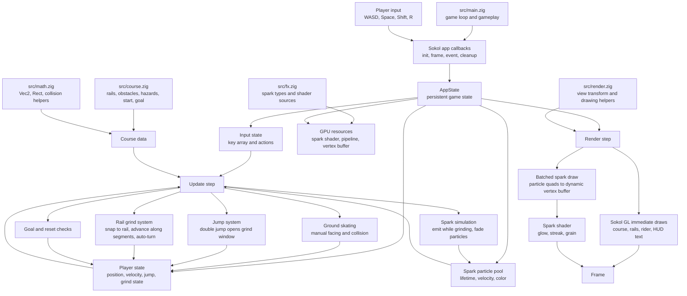

# Glowtrail Architecture

Glowtrail is a compact Zig/Sokol game. The game is currently built as a small set of focused modules so iteration stays fast during prototyping.

## Main Files

- `build.zig` defines native and web build targets and links Sokol.
- `web/shell.html` is the browser shell and visible web controls prompt.
- `src/main.zig` contains the Sokol callbacks, `AppState`, gameplay update flow, player movement, jumping, grinding, spark emission, and HUD.
- `src/course.zig` owns the course constants: world size, rail point lists, obstacles, hazards, start, and goal.
- `src/math.zig` owns small geometry types and helpers like `Vec2`, `Rect`, `closestPointOnSegment`, and collision math.
- `src/render.zig` owns view transforms and reusable Sokol GL drawing helpers for the course and player shapes.
- `src/fx.zig` owns spark particle/vertex types and the platform-specific spark shader source strings.

## Runtime Flow

1. Sokol calls `init`, which initializes graphics, debug text, and the spark shader pipeline.
2. Sokol calls `event` whenever keys are pressed or released. The game stores key state and triggers actions like jump, grind, or reset.
3. Sokol calls `frame` every tick. The frame computes `dt`, updates the simulation, and renders.
4. The update step chooses ground skating or rail grinding, advances jump state, emits spark particles, and checks hazards or the goal.
5. The render step uses `render.zig` for course/player drawing, then draws spark particles through the custom GPU shader in `fx.zig`.

## Gameplay Systems

- Manual skating: WASD or arrow keys accelerate the rider and set facing.
- Jumping: Space starts a jump. Pressing Space again opens a short grind window.
- Grinding: Shift near a rail during the grind window snaps the rider to the nearest rail segment. Rail movement advances segment by segment, so corners auto-turn.
- Sparks: grinding emits particles from a fixed pool. Each live particle becomes a small quad sent to the GPU spark shader.

## Data Ownership

`AppState` owns mutable state:

- input key states
- player state
- spark particle pool
- GPU spark resources
- HUD message state

The course layout is immutable global data:

- rail point arrays
- obstacle rectangles
- hazard rectangles
- start and goal rectangles

This separation keeps the current prototype easy to reset, tune, and eventually split into modules.
